# Linux lift and shift

## Hands-on lab step-by-step

## March 2018

Information in this document, including URL and other Internet Web site references, is subject to change without notice. Unless otherwise noted, the example companies, organizations, products, domain names, e-mail addresses, logos, people, places, and events depicted herein are fictitious, and no association with any real company, organization, product, domain name, e-mail address, logo, person, place or event is intended or should be inferred. Complying with all applicable copyright laws is the responsibility of the user. Without limiting the rights under copyright, no part of this document may be reproduced, stored in or introduced into a retrieval system, or transmitted in any form or by any means (electronic, mechanical, photocopying, recording, or otherwise), or for any purpose, without the express written permission of Microsoft Corporation.

Microsoft may have patents, patent applications, trademarks, copyrights, or other intellectual property rights covering subject matter in this document. Except as expressly provided in any written license agreement from Microsoft, the furnishing of this document does not give you any license to these patents, trademarks, copyrights, or other intellectual property.

The names of manufacturers, products, or URLs are provided for informational purposes only and Microsoft makes no representations and warranties, either expressed, implied, or statutory, regarding these manufacturers or the use of the products with any Microsoft technologies. The inclusion of a manufacturer or product does not imply endorsement of Microsoft of the manufacturer or product. Links may be provided to third party sites. Such sites are not under the control of Microsoft and Microsoft is not responsible for the contents of any linked site or any link contained in a linked site, or any changes or updates to such sites. Microsoft is not responsible for webcasting or any other form of transmission received from any linked site. Microsoft is providing these links to you only as a convenience, and the inclusion of any link does not imply endorsement of Microsoft of the site or the products contained therein.
© 2018 Microsoft Corporation. All rights reserved.

Microsoft and the trademarks listed at https://www.microsoft.com/en-us/legal/intellectualproperty/Trademarks/Usage/General.aspx are trademarks of the Microsoft group of companies. All other trademarks are property of their respective owners.

## Contents
<!-- TOC -->

- [Linux lift and shift](#linux-lift-and-shift)
    - [Hands-on lab step-by-step](#hands-on-lab-step-by-step)
    - [March 2018](#march-2018)
    - [Contents](#contents)
    - [Linux lift and shift hands-on lab step-by-step](#linux-lift-and-shift-hands-on-lab-step-by-step)
    - [Abstract and learning objectives](#abstract-and-learning-objectives)
    - [Overview](#overview)
    - [Requirements](#requirements)
    - [Help References](#help-references)
    - [Before the hands-on lab](#before-the-hands-on-lab)
        - [Task 1: Create a virtual machine to execute the lab](#task-1--create-a-virtual-machine-to-execute-the-lab)
        - [Task 2: Install the MySQL Workbench](#task-2--install-the-mysql-workbench)
    - [Exercise 1: Deploy the on-premises OsTicket VM application](#exercise-1--deploy-the-on-premises-osticket-vm-application)
        - [Task 1: Deploy the OnPremVM](#task-1--deploy-the-onpremvm)
        - [Task 2: Export the osticket database](#task-2--export-the-osticket-database)
    - [Exercise 2: Migrate to Azure IaaS VM Scale Sets and MySQL cluster](#exercise-2--migrate-to-azure-iaas-vm-scale-sets-and-mysql-cluster)
        - [Task 1: Deploy the MySQL HA cluster](#task-1--deploy-the-mysql-ha-cluster)
        - [Task 2: Connect to the MySQL cluster and restore the database](#task-2--connect-to-the-mysql-cluster-and-restore-the-database)
        - [Task 3: Deploy the Virtual Machine Scale Set for the OsTicket Application](#task-3--deploy-the-virtual-machine-scale-set-for-the-osticket-application)
        - [Task 4: Connect the MySQLVNet to the Scale Sets VNet](#task-4--connect-the-mysqlvnet-to-the-scale-sets-vnet)
        - [Task 5: Export the osticket database from the MySQL cluster](#task-5--export-the-osticket-database-from-the-mysql-cluster)
    - [Exercise 3: Migrate the OsTicket application from Azure IaaS to PaaS](#exercise-3--migrate-the-osticket-application-from-azure-iaas-to-paas)
        - [Task 1: Create the MySQL database](#task-1--create-the-mysql-database)
        - [Task 2: Restore the osticket database to MySQL PaaS](#task-2--restore-the-osticket-database-to-mysql-paas)
        - [Task 3: Create the Web App](#task-3--create-the-web-app)
        - [Task 4: Configure the OsTicket Web App](#task-4--configure-the-osticket-web-app)
    - [After the hands-on lab](#after-the-hands-on-lab)

<!-- /TOC -->

## Linux lift and shift hands-on lab step-by-step

## Abstract and learning objectives

In this step-by-step Microsoft Cloud Workshop, you will migrate a Linux based application to the Azure Cloud. This will include the use of Azure IaaS Virtual Machines and Virtual Machine Scale Sets. Azure PaaS will also be leveraged including: Azure App Services (Web App), and Azure Database for MySQL. The student will leverage Azure Resource Manager templates, the Linux custom script extension, Github and a Linux Docker Container in the App Service.

## Overview

In this hands-on step-by-step lab, you will migrate an on-premises based helpdesk application called OsTicket to Azure. This will be a two-phase project to lift and shift the application into Azure IaaS and then migrate it to Azure PaaS. The application is Linux based using Apache, PHP and MySQL (LAMP). During the process of these phases you will ensure zero data loss.

-   **Phase I:** Lift and shift the application from on-premises to Azure IaaS using an auto scaling Virtual Machine Scale Set and a MySQL cluster with 3 nodes.

-   **Phase II:** Migrate to PaaS using Azure App Services with a Linux Docker Container and Azure Database for MySQL.

**Phase I will result in an environment resembling this diagram:**


**Phase II will result in an environment resembling this diagram:**


## Requirements

You must have a working Azure subscription to carry out this hands-on Lab step-by-step.

## Help References

|    |            |
|----------|:-------------:|
| **Description** | **Links** |
| Azure Database for MySQL | <https://docs.microsoft.com/en-us/azure/mysql/> |
| Azure Database for MySQL | <https://docs.microsoft.com/en-us/azure/mysql/howto-create-manage-server-portal/> |
| Azure Database for MySQL | <https://docs.microsoft.com/en-us/azure/mysql/howto-manage-firewall-using-portal/> |
| Connect Azure Web App to Azure Database for MySQL | <https://docs.microsoft.com/en-us/azure/mysql/howto-connect-webapp/> |
| Azure Virtual Machine Scale Sets | <https://docs.microsoft.com/en-us/azure/virtual-machine-scale-sets/> |
| Using VM Extensions with Azure Virtual Machine Scale Sets | <https://docs.microsoft.com/en-us/azure/virtual-machine-scale-sets/virtual-machine-scale-sets-deploy-scaling-app-template/> |
| App Service for Linux | <https://docs.microsoft.com/en-us/azure/app-service/containers/app-service-linux-intro/> |
| Azure CLI | <https://docs.microsoft.com/en-us/cli/azure/install-azure-cli/> |

## Before the hands-on lab

Duration: 30 Minutes

### Task 1: Create a virtual machine to execute the lab

1.  Launch a browser and navigate to <https://portal.azure.com>. Once prompted, login with your Microsoft Azure credentials. If prompted, choose whether your account is an organization account or just a Microsoft Account.

2.  Click on **+NEW**, and in the search box type in **Visual Studio Community 2017 on Windows Server 2016 (x64)** and press enter. Click the Visual Studio Community 2017 image running on Windows Server 2016 and with the latest update.

3.  In the returned search results, click the image name.

    

4.  Click **Create**.

5.  Set the following configuration on the Basics tab and click **OK**.

    -   Name: **LABVM**

    -   VM disk type: **SSD**

    -   User name: **demouser**

    -   Password: **demo\@pass123**

    -   Subscription: **If you have multiple subscriptions choose the subscription to execute your labs in.**

    -   Resource Group: **OPSLABRG**

    -   Location: **Choose the closest Azure region to you.**

    

6.  Choose the **DS1\_V2 Standard** instance size on the Size blade.

**Note**: You may have to click the View All link to see the instance sizes.


**Note**: If the Azure Subscription you are using is [NOT]{.underline} a trial Azure subscription you may want to chose the DS2\_V2 to have more power in this LABMV. If you are using a Trial Subscription or one that you know has a restriction on the number of cores stick with the DS1\_V2.

7.  Click **Storage Account** *Configure required settings* to specify a storage account for your virtual machine if a storage account name is not automatically selected for you.

    

8.  Click **Create New**

    

9.  Specify a unique name for the storage account (all lower letters and alphanumeric characters) and ensure the green checkmark shows the name is valid.

    

10. Click **OK** to continue.

11. Click **Diagnostics Storage Account** *Configure required settings* for the Diagnostics storage account if a storage account name is not automatically selected for you. Repeat the previous steps to select a unique storage account name. This storage account will hold diagnostic logs about your virtual machine that you can use for troubleshooting purposes.

    

12. Accept the remaining default values on the Settings blade and click **OK**. On the Summary page click **Create**. The deployment should begin provisioning. It may take 10+ minutes for the virtual machine to complete provisioning.

    

**Note**: Please wait for the LABVM to be provisioned prior to moving to the next step.

13. Move back to the Portal page on your local machine and wait for **LABVM** to show the Status of **Running**. Click **Connect** to establish a new Remote Desktop Session.

    

14. Depending on your remote desktop protocol client and browser configuration you will either be prompted to open an RDP file, or you will need to download it and then open it separately to connect.

15. Log in with the credentials specified during creation:

    a.  User: **demouser**

    b.  Password: **demo\@pass123**

16. You will be presented with a Remote Desktop Connection warning because of a certificate trust issue. Click **Yes** to continue with the connection.

    

17. When logging on for the first time you will see a prompt on the right asking about network discovery. Click **No**.

    

18. Notice that Server Manager opens by default. On the left, click **Local Server**.

    

19. On the right side of the pane, click **On** by **IE Enhanced Security Configuration**.

    

20. Change to **Off** for Administrators and click **OK**.

    

### Task 2: Install the MySQL Workbench

1.  While logged into **LABVM** via remote desktop, open Internet Explorer and navigate to <https://dev.mysql.com/get/Downloads/MySQLGUITools/mysql-workbench-community-6.3.10-winx64.msi> this will download an executable. After the download is finished, click **Run** to execute it.

2.  Follow the directions of the installer to complete the installation of MySQL Workbench.

3.  After the installation is complete, **reboot** the machine.

You should follow all steps provided *before* attending the Hands-on lab.

## Exercise 1: Deploy the on-premises OsTicket VM application

Duration: 45 Minutes

In this exercise, you will deploy a VM using an ARM template that will act as the on-premises installation of the OsTicket application. This will consist of a single Ubuntu Linux 16.04-LTS VM with Apache, PHP and MySQL installed (LAMP). This application is a helpdesk management software that you will lift and shift into Azure. There is sample data in the application that will be retained throughout the two phases of the project.


### Task 1: Deploy the OnPremVM

1.  From the Azure portal, click on the Cloud Shell icon on the top navigation.

    

2.  Execute the following command to create a resource group that will contain the application. 

**Note**: You can also specify an alternate region.

    az group create --name OsTicketOnPremRG --location "East US"

3.  Execute the following command to deploy the ARM template.

    az group deployment create --name OsTicketOnPremRG --resource-group OsTicketOnPremRG --template-uri " https://cloudworkshop.blob.core.windows.net/linux-lift-shift/onpremvmdeploy.json" 

4.  This deployment will take about 5 minutes to complete. Wait until it has been deployed before moving on to the next step.

5.  Once the deployment has completed open the resource group **OsTicketOnPremRG** and review the deployment.

    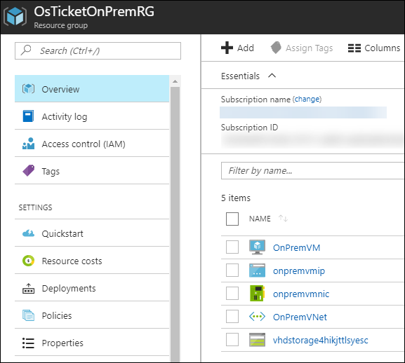

6.  Next click on the **onpremvmip** Public IP address. Locate the IP address and paste this into a new tab of your web browser. The Support Center OsTicket application should load.

    

7.  Click the Sign in link.

    

8.  Locate **I'm an agent** and click the **sign in here** link.

    

9.  At the OsTicket screen enter the **username** and **password** and click **Log In**.

    a.  Username: ***demouser***

    b.  Password: ***demo\@pass123***

    

10. Once logged into the OsTicket system click **My Tickets**.

    

11. On the **My Tickets** screen click through to one of the tickets.

    

12. Next, Click the Users Tab and notice the users that are entered into the system.

    

13. Feel free to create new tickets or new users to add to your dataset.

### Task 2: Export the osticket database

1.  From your **LABVM**, connect to the Azure portal and then open the **OsTicketOnPremRG** resource group.

    

2.  Locate the **onpremvmip** Public IP address and **take note of the address**.

    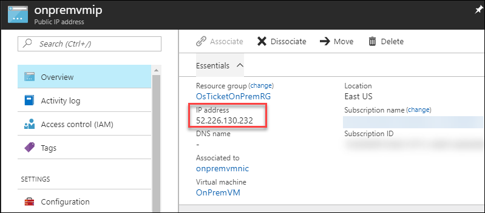

3.  Next on the LABVM click Start and then locate the MySQL Workbench.

    

4.  Click the Plus sign next to MySQL Connections on the Workbench.

    

5.  Enter the following information to configure to connect to your OnPremVM**.**

    -   Connection Name: **OnPremVM**

    -   Connection Method: **Standard TCP/IP over SSH**

    -   SSH Hostname: **\<enter the Public ip address\>**

    -   SSH Username: **demouser**

    -   SSH Password: **Click Store in Vault: demo\@pass123**

    -   MySQL Hostname: **127.0.0.1**

    -   MySQL Server Port: **3306**

    -   Username: **osticket**

    -   Password: **Click Store in Vault: demo\@pass123**

    

6.  Once configured click **Test Connection**.

7.  A popup will appear with a notice that the **SSH Server Fingerprint Missing**, click **continue**.

    

8.  If configured correctly you will receive a message: **Successfully made the MySQL Connection**. Click OK.

    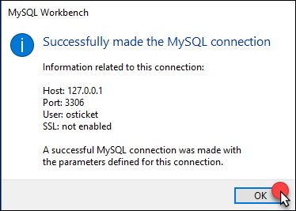

9.  The Connection will appear. Double-click to start a session with the MySQL instance running on the **OnPremVM**.

    

10. Once the Workbench loads, click **Server Status**. Review the details of the server.

    

11. Next, click the **osticket** database under Schemas and expand to see the tables.

    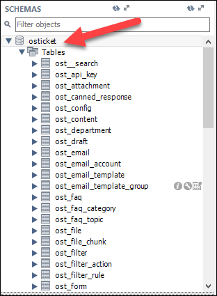

12. Locate the **ost\_user** table, **right-click** and then click **Select Rows -- Limit 1000**.

    

13. This will launch a query in the Workbench and list all of the users on the system. Notice that these are the same users that you saw in the OsTicket UI.

    

14. Click **Data Export**.

    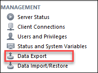

15. On the **Data Export** screen, select the **osticket**. Then select **Export to Self-Contained File**, and named the file **c:\\HOL\\onpremvm.sql** and click **Start Export**.

    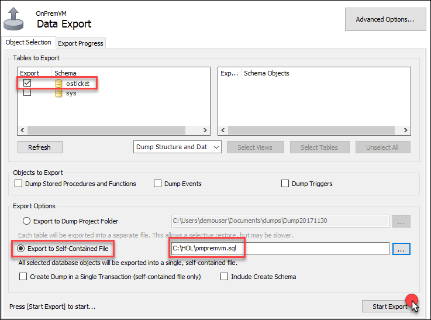

16. You will get a version mismatch warning, click **Continue Anyway**.

    

17. Once the export has completed you will receive this message.

    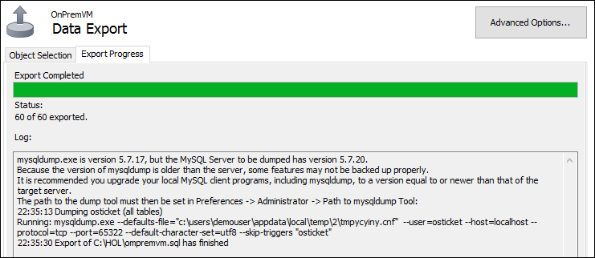

## Exercise 2: Migrate to Azure IaaS VM Scale Sets and MySQL cluster

Duration: 90 Minutes

In this exercise, you will deploy the OsTicket application to Azure IaaS. In the first task, you will deploy and configure a MySQL Cluster with multiple nodes. Next, you will restore the database that was exported using MySQL Workbench. After the data tier of your application has been configured you will deploy a Virtual Machine Scale Set. The OsTicket application will be installed on the instances using the Custom Linux Extension and will be self-configuring. The Scale Set will be setup to autoscale and the VMs that spin up will also self-configuring.


### Task 1: Deploy the MySQL HA cluster

1.  From the Azure portal, click on the Cloud Shell icon on the top navigation.

    

2.  Execute the following command to create a resource group that will contain the MySQL HA environment. 

**Note**: Ensure you that use the same region as the OsTicket application.

    az group create --name OsTicketMySQLVMRG --location "East US"

3.  Execute the following command to deploy the ARM template.

    az group deployment create --name OsTicketMySQLVMRG --resource-group OsTicketMySQLVMRG --template-uri "https://cloudworkshop.blob.core.windows.net/linux-lift-shift/mysqlhadeploy.json" 

**Note**: The settings that are being deployed as part of the template will be referenced later in the lab.

-   OS User Name: **bitnami**

-   OS Admin Password: **demo\@pass123**

-   App Database: **osticket**

-   App Password: **demo\@pass123**

4.  This deployment will take about 15 minutes to complete. Wait until it has been deployed before moving on to the next step.

5.  Once the deployment has completed open the **OsTicketMySQLVMRG** and review the deployment. Notice that there are three VMs which are a part of a three node MySQL cluster.

    

6.  Locate the **osticketip** Public IP address and **take note of the address**. Notice that this is attached the VM **osticket0** which is the master node in the cluster.

    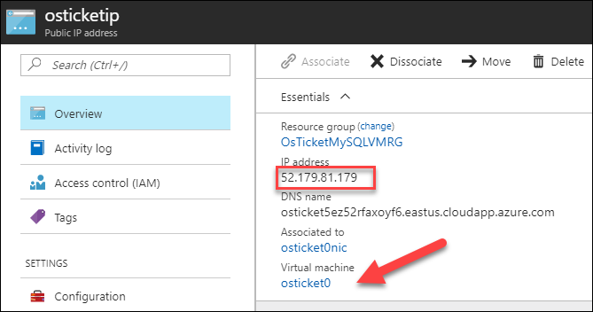

### Task 2: Connect to the MySQL cluster and restore the database

1.  On the **LABVM**, click Start and then locate the MySQL Workbench.

    

2.  Click the Plus sign next to MySQL Connections on the Workbench.

    

3.  Enter the following information to configure to connect to your MySQL master node.

    -   Connection Name: **MySQL Cluster**

    -   Connection Method: **Standard TCP/IP over SSH**

    -   SSH Hostname: **\<enter the Public ip address\>**

    -   SSH Username: **bitnami**

    -   SSH Password: Click Store in Vault: **demo\@pass123**

    -   MySQL Hostname: **127.0.0.1**

    -   MySQL Server Port: **3306**

    -   Username: **root**

    -   Password: **Click Store in Vault: demo\@pass123**

    

4.  Once configured click **Test Connection**.

5.  A popup will appear with a notice that the **SSH Server Fingerprint Missing**, click **continue**.

    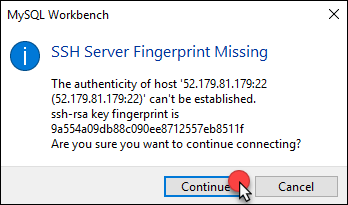

6.  If configured correctly you will receive a message: **Successfully made the MySQL Connection**, Click **OK**.

    

7.  Click **OK** to save the connection that you just configured.

8.  The Connection will appear. Double-click to start a session with the MySQL Cluster instance running on the Azure IaaS.

    

9.  Once the Workbench loads, click **Server Status**. Review the details of the cluster. Remember you are connected to the master for the cluster.

    

10. Click the New Query button.

    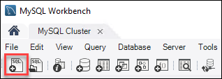

11. Execute the following query to show the status of the cluster nodes known as "Slaves". Click the **Lighting Bolt** to run the query. Notice that the two replication partners appear in the results window as well as their TCP port of 3306.
    ```
    SHOW SLAVE HOSTS
    ```
    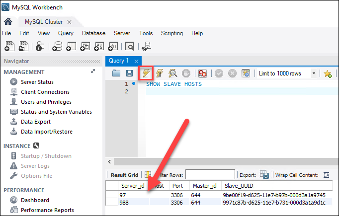

12. Next, click the **osticket** database under Schemas and expand to see the tables. This time notice that nothing is in the database yet since you have not restored it yet.

    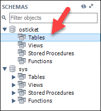

13. This is the part of the lift and shift where we will restore the existing database for the application. Click the **Data Import/Restore** button.

    

14. On the Data Import screen click the **Import from Self-Contained File**, and then select the **C:\\HOL\\onpremvm.sql** datafile.

    

15. Next, set the Default Target Schema as **osticket** and click **Start Import**. This will restore the data from the **OnPremVM** to the MySQL cluster.

    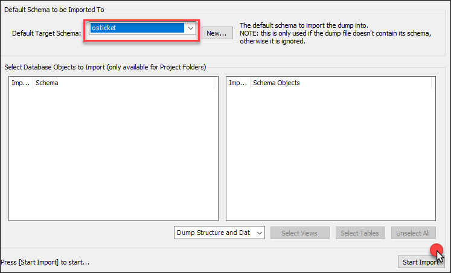

16. Once the restore is completed the following screen will appear.

    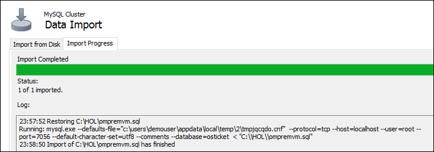

17. Move back to the Schemas area of the MySQL Workbench, and click the refresh icon.

    

18. The tables of the database now appear since they have been restored. Locate the **ost\_user** table, **right-click** and then click **Select Rows -- Limit 1000**.

    

19. This will launch a query in the Workbench and list all the users on the system. Notice that now the data from the application has been Lifted and Shifted into a MySQL Cluster running in Azure IaaS. This means that there was zero data loss from the move to the cluster.

    

### Task 3: Deploy the Virtual Machine Scale Set for the OsTicket Application

1.  From the Azure portal, click on the Cloud Shell icon on the top navigation.

    

2.  Execute the following command to create a resource group that will contain the MySQL HA environment. 

**Note**: Ensure you that use the same region as the OsTicket application.

    az group create --name OsTicketVMSSRG --location "East US"

3.  Execute the following command to deploy the ARM template. This command requires a parameter to be passed to the template. In the example, osticketXX is used. Replace that value with a unique value that is lowercase and less than 10 characters.

    az group deployment create --name OsTicketVMSSRG --resource-group OsTicketVMSSRG --template-uri "https://cloudworkshop.blob.core.windows.net/linux-lift-shift/scalesetdeploy.json" --parameters vmssName=osticketXX

Take note of the credentials for the VMSS.

-   Admin Username: **demouser**

-   OS Admin Password: **demo\@pass123**

4.  Once the deployment has completed open the **OsTicketVMSSRG** and review the deployment.

    

5.  Open the Virtual Machine Scale Set. Notice that there are two instances (to start out with), which are a part of a VM Scale Set and that autoscaling has been enabled. After some time, it will be scaled down to only one instance given the lack of traffic to the site.

    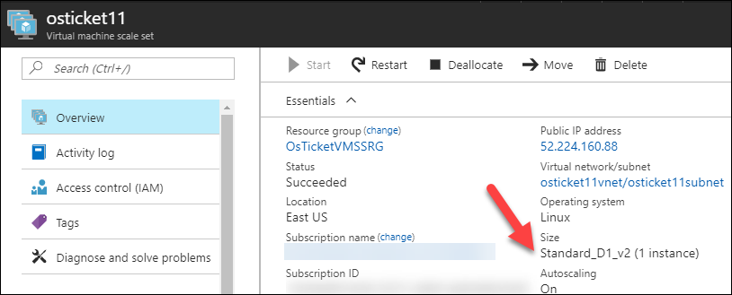

6.  Take note of the Public IP address.

7.  If you browse to the IP address if a new tab you will not be able to connect to the webpage. This is due to the lack of connectivity to the MySQL Cluster.

8.  Click the Instances link in Settings.

    

9.  Here you can take different actions on the Scale Set instances. Click on the instances, and review the information pane.

    

10. In the information pane notice the "Latest model applied" information. This is where you can update the image being used for the OS. By selecting the instances and then clicking the update, you can apply system updates to the VMs that are currently running.

    

11. Click the Scaling link in the Settings area of the Scale Set.

    

12. Review the Rules for Scale Out and Scale In.

    

13. Click the **Notify** tab on this page, click the **Email Administrators**, **Email co-administrators**, and add any additional emails you wish. Also, notice that a Webhook could be entered here. Anytime an event happens with autoscaling Azure will send a notification. Click **Save** to configure.

    

### Task 4: Connect the MySQLVNet to the Scale Sets VNet

The MySQL Cluster and the Scale Set and running in isolated VNets. To bring the OsTicket application online, you will need to create a peering between these VNets. This was the reason that both deployments needed to be in the same regions along with performance hit if they were in different regions.

1.  In the Azure portal, click on **Virtual Networks** followed by **MySQLVNet** and **Peerings**.

    

2.  Click **+Add**.

    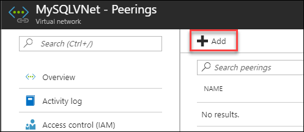

3.  Enter the name **OSTicketPeering** followed by **Choose a virtual network**. Select the VNet you created with your Scale Set. Click **OK**.

    

4.  Your peering will appear in the blade as Initiated (you may have to refresh the blade to see this update).

    

5.  In the Azure portal click on **Virtual Networks** followed by the name of your **Scale Set VNet** and **Peerings**. In the case of the example, the VNet is named **osticket11vnet**.

    

6.  Click **+Add**.

    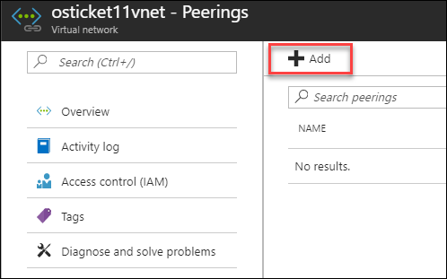

7.  Enter the name **OSTicketPeering** followed by **Choose a virtual network**. Select the VNet that you created with your Scale Set. Click **OK**.

    

8.  Your peering will appear in the blade as Connected (you may have to refresh the blade to see this update).

    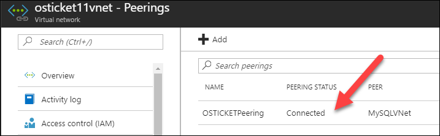

9.  Immediately, the two networks can see each other which means the Scale Set will be able to see the MySQL Cluster. Open a new browser tab and attempt to connect to the Public IP address of the Scale Set. You should see the Support Center website again.

    

10. Click the Sign in link.

    

11. Locate **I'm an agent**, and click the **sign in here** link.

    

12. At the OsTicket screen enter the **username** and **password**, and click **Log In**.

    a.  Username: ***demouser***

    b.  Password: ***demo\@pass123***

    

13. Once logged into the OsTicket system, click **My Tickets**.

    

14. On the **My Tickets** screen, click through to one of the tickets. Once again, you see that the data from the on-premises installation of the OsTicket system is preserved which means that ***you have successfully lifted and shifted the application to Azure IaaS!***

    

### Task 5: Export the osticket database from the MySQL cluster

1.  Next on the **LABVM** click Start and then locate the MySQL Workbench.

    

2.  Double-click to start a session with the MySQL cluster.

    

3.  Click **Data Export**.

    

4.  On the **Data Export** screen, select the **osticket**. Then select **Export to Self-Contained File**, and name the file **C:\\HOL\\mysqlcluster.sql** and click **Start Export**.

    

5.  You will get a version mismatch warning, click **Continue Anyway**.

    

6.  Once the export has completed, you will receive this message.

    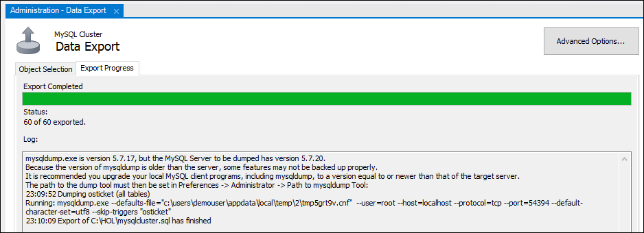

## Exercise 3: Migrate the OsTicket application from Azure IaaS to PaaS

Duration: 60 Minutes

In this exercise, you will implement Phase II of the migration to Azure. Here you will retire the Azure IaaS implementation and move to Azure App Service and Azure Database for MySQL. The first steps will be to build the MySQL DB and again migrate the data using MySQL Workbench. Then, you will create the Azure Web App and connect it to GitHub Repo to download the app using a Docker Container with PHP 7.0.


### Task 1: Create the MySQL database

1.  From the Azure portal, click on the Cloud Shell icon on the top navigation.

    

2.  Execute the following command to create a resource group to contain the MySQL DB.

    az group create --name OsTicketPaaSRG --location "East US"

3.  Execute the following command to create a MySQL Database. 
  
**Note**: You must choose a unique name for the MySQL server. Replace **osticketsrv01** with a more unique value.

    az mysql server create --resource-group OsTicketPaaSRG --name osticketsrv01 --location "East US" --admin-user demouser --admin-password demo@pass123 --performance-tier Basic --storage-size 51200 --ssl-enforcement Disabled

4.  Add an open firewall rule to the database by executing the following command. Ensure you replace the server name with the unique value from the previous step.

    az mysql server firewall-rule create --resource-group OsTicketPaaSRG --server-name osticketsrv01 --name Internet --start-ip-address 0.0.0.0 --end-ip-address 255.255.255.255

5.  Once the MySQL database has been deployed, locate and open it from the **OsTicketPaaSRG** resource group using the Azure Portal.

6.  Click **Connection Strings**.

    

7.  Locate the Web App script, and press the **Click the copy** button.

    

8.  Open a new notepad window and paste this into a new file to retain this string and more information in the next few steps. Update the **database** section to **osticket** and the **password** section to **demo\@pass123.**

    

9.  Click Overview for the MySQL server.

    

10. Notice the **Server name** and **Server Admin Login** name. You can compare them the connection string that you copied into the text file (they should be the same).

    

11. Scroll down, and notice that there are currently four databases that are running on your server.

    

### Task 2: Restore the osticket database to MySQL PaaS

1.  On the **LABVM**, click Start and then, locate the MySQL Workbench.

    

2.  Click the Plus sign next to MySQL Connections on the Workbench.

    

3.  Enter the following information to configure to connect to your Server**.**

    -   Connection Name: **\<enter your MySQL Server DNS Name -- found in the connection string \>**

    -   Connection Method: **Standard TCP/IP**

    -   MySQL Hostname: **\<enter your MySQL Server DNS Name -- found in the connection string \>**

    -   MySQL Server Port: **3306**

    -   Username: **\<enter your user name -- found in the connection string\>**

    -   Password: **Click Store in Vault: demo\@pass123**

    

4.  Once configured, click the Test Connection Button.

    

5.  If configured correctly you will receive a message: **Successfully made the MySQL Connection**, Click **OK**.

    

6.  Click **OK** to save the connection that you just configured.

7.  The Connection will appear. Double-click to start a session with the MySQL database server running on the Azure PaaS.

    

8.  Once the Workbench loads, click **Server Status**. Review the details of the MySQL PaaS Server.

    

9.  This is the part of the lift and shift where we will restore the existing database for the application. Click the **Data Import/Restore** button.

    

10. On the Data Import screen, click the **Import from Self-Contained File**, and select the **c:\\HOL\\mysqlcluster.sql** datafile.

    

11. Click New, next to the **Default Schema to be Imported To**.

    

12. On the Create Schema menu, type **osticket** and click OK.

    

13. MySQL Workbench will create the Schema (database), on the server for you and select it as the Default Target Schema for the restore.

    

14. Click **Start Import** after reviewing the screen.

    

15. Once the restore is completed, the following screen will appear.

    

16. Move back to the Schemas area of the MySQL Workbench, and click the refresh icon.

    

17. The tables of the database now appear since they have been restored. Locate the **ost\_user** table, **right-click**, and click **Select Rows -- Limit 1000**.

    

18. This will launch a query in the Workbench and list all of the users on the system. Notice that now the data from the application has been Lifted and Shifted into a MySQL server running in Azure PaaS. This means there was zero data loss from the move to PaaS.

    

19. Move back to the Azure portal, and click Overview for the MySQL server.

    

20. Scroll down and notice now, there are five databases and the addition of the **osticket**.

    

### Task 3: Create the Web App

1.  From the Azure portal, click on the Cloud Shell icon on the top navigation.

    

2.  Execute the following command to create a Linux-based App Service Plan for the new web app.

    az appservice plan create -n OsTicket -g OsTicketPaaSRG --is-linux -l "East US 2" --sku S1 --number-of-workers 1

3.  Execute the following command to create a new web app configured for PHP 7.0 inside of the new app service plan. The name of the web app must be unique, so specify some numbers at the end to make it a more unique value.

    az webapp create -n osticketsystem -g OsTicketPaaSRG -p OsTicket -r "php|7.0"

4.  Once the deployment has completed, open the **OsTicketPaaSRG** resource group. Notice there are now three objects: **MySQL database, Linux App Service Plan** and the **Web App**.

    

### Task 4: Configure the OsTicket Web App

1.  Open the Web App using the Azure portal. Notice the details of the application including the **URL**.

    

2.  If you click the **URL**, the default webpage will load.

3.  In the Azure portal, click **Application settings** in the Settings area.

    

4.  Locate the Connection Strings section. Enter the name **osticket**, and copy the string into the **value area** from notepad. Select **MySQL** in the dropdown list next to the string. Click **Save**.

    

5.  Open a new browser tab and connect to <https://github.com/opsgility/osTicket>. This is a public repo for the OsTicket software. Sign in to your GitHub account or create a new one.

    

6.  On this page locate and then click the **Fork** button.

    

7.  If prompted, select your personal account when prompted with **"Where should we fork this repository?"**

    

8.  After the repo is forked to your GitHub account, scroll down and locate the **include** folder and click it.

    

9.  Once in the **include** folder, scroll down and locate the file named **ost-config.php**.

    

10. The file will open in the browser. Click the **Pencil** icon to edit this file.

    

11. The file with open in an editor. Scroll down to the Database Options area of the file. Update the text in this file with your MySQL database settings from your notepad file. The **DBHOST** name and the **DBUSER** should be updated. See below for the before and after comparison.

    Before:

    

    After:

    

12. Once you have updated the text, scroll down enter a command and click **Commit changes**.

    

13. Move back to the Azure portal on the Web App and click **Deployment options** under the Deployment area.

    

14. Click **Choose Source**, *Configure required settings*

    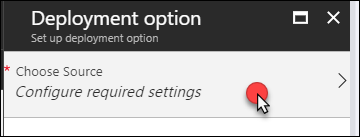

15. Click GitHub.

    

16. Click Authorization if you have not connected your GitHub account to the Azure portal follow the prompts.

17. Click Choose your organization if your GitHub personal account is not shown.

18. Click Choose project.

    

19. Select the **osticket** repo.

    

20. Configure your selections and then click **OK.**

    

21. The OsTicket application will be downloaded from the GitHub account. First, it will show as Pending and then Active. It may take a minute for it to appear in Deployment Options.

    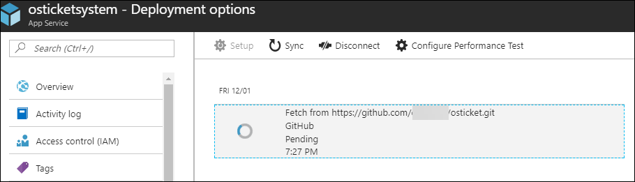

    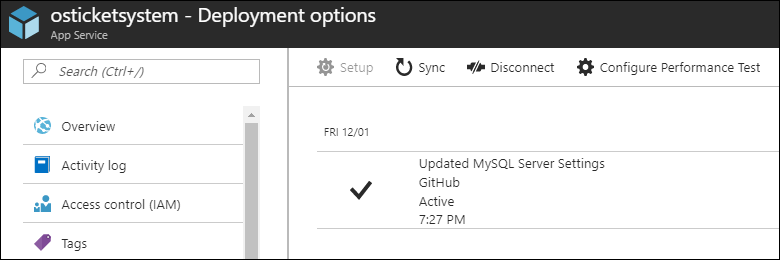

22. Click back to the **Overview** page, and then click the **URL** for the Web App.

    

23. Immediately the Web App will load you should see the Support Center website again.

    

24. Click the Sign in link.

    

25. Locate **I'm an agent** and click the **sign in here** link.

    

26. At the OsTicket screen, enter the **username** and **password** and click **Log In**.

    a.  Username: ***demouser***

    b.  Password: ***demo\@pass123***

    

27. Once logged into the OsTicket system click **My Tickets**.

    

28. On the **My Tickets** screen, click through to one of the tickets. Once again, you see that the data from the IaaS installation of the OsTicket system is preserved which means that you have successfully lifted and shifted the application to Azure PaaS!

## After the hands-on lab

Duration: 10 minutes

After you have successfully completed the Linux Lift & Shift Azure hands-on lab step-by-step, you will want to delete the Resource Groups. This will free up your subscription from future charges.

-   OPSLABRG

-   OsTicketMySQLVMRG

-   OsTicketOnPremRG

-   OsTicketPaaSRG

-   OsTicketVMSSRG

You should follow all steps provided *after* attending the Hands-on lab.

