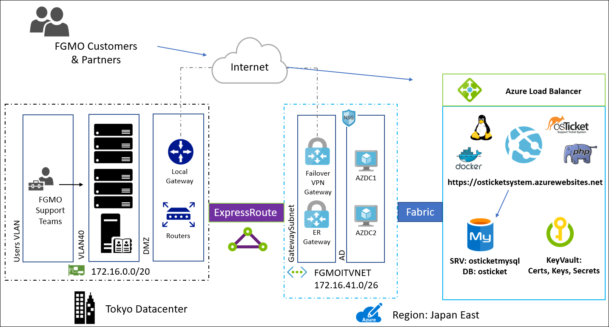

Linux lift and shift

 Whiteboard design session trainer guide

September 2018

Information in this document, including URL and other Internet Web site references, is subject to change without notice. Unless otherwise noted, the example companies, organizations, products, domain names, e-mail addresses, logos, people, places, and events depicted herein are fictitious, and no association with any real company, organization, product, domain name, e-mail address, logo, person, place or event is intended or should be inferred. Complying with all applicable copyright laws is the responsibility of the user. Without limiting the rights under copyright, no part of this document may be reproduced, stored in or introduced into a retrieval system, or transmitted in any form or by any means (electronic, mechanical, photocopying, recording, or otherwise), or for any purpose, without the express written permission of Microsoft Corporation.

Microsoft may have patents, patent applications, trademarks, copyrights, or other intellectual property rights covering subject matter in this document. Except as expressly provided in any written license agreement from Microsoft, the furnishing of this document does not give you any license to these patents, trademarks, copyrights, or other intellectual property.

The names of manufacturers, products, or URLs are provided for informational purposes only and Microsoft makes no representations and warranties, either expressed, implied, or statutory, regarding these manufacturers or the use of the products with any Microsoft technologies. The inclusion of a manufacturer or product does not imply endorsement of Microsoft of the manufacturer or product. Links may be provided to third party sites. Such sites are not under the control of Microsoft and Microsoft is not responsible for the contents of any linked site or any link contained in a linked site, or any changes or updates to such sites. Microsoft is not responsible for webcasting or any other form of transmission received from any linked site. Microsoft is providing these links to you only as a convenience, and the inclusion of any link does not imply endorsement of Microsoft of the site or the products contained therein.
© 2018 Microsoft Corporation. All rights reserved.

Microsoft and the trademarks listed at https://www.microsoft.com/en-us/legal/intellectualproperty/Trademarks/Usage/General.aspx are trademarks of the Microsoft group of companies. All other trademarks are property of their respective owners.

**Contents** 

<!-- TOC -->

- [Trainer information](#trainer-information)
    - [Role of the trainer](#role-of-the-trainer)
    - [Whiteboard design session flow](#whiteboard-design-session-flow)
    - [Before the whiteboard design session: How to prepare](#before-the-whiteboard-design-session-how-to-prepare)
    - [During the whiteboard design session: Tips for an effective whiteboard design session](#during-the-whiteboard-design-session-tips-for-an-effective-whiteboard-design-session)
- [Linux lift and shift whiteboard design session student guide](#linux-lift-and-shift-whiteboard-design-session-student-guide)
    - [Abstract and learning objectives](#abstract-and-learning-objectives)
    - [Step 1: Review the customer case study](#step-1-review-the-customer-case-study)
        - [Customer situation](#customer-situation)
        - [Customer needs](#customer-needs)
        - [Customer objections](#customer-objections)
        - [Infographic for common scenarios](#infographic-for-common-scenarios)
    - [Step 2: Design a proof of concept solution](#step-2-design-a-proof-of-concept-solution)
    - [Step 3: Present the solution](#step-3-present-the-solution)
    - [Wrap-up](#wrap-up)
    - [Additional references](#additional-references)
- [Linux lift and shift whiteboard design session trainer guide](#linux-lift-and-shift-whiteboard-design-session-trainer-guide)
    - [Step 1: Review the customer case study](#step-1-review-the-customer-case-study-1)
    - [Step 2: Design a proof of concept solution](#step-2-design-a-proof-of-concept-solution-1)
    - [Step 3: Present the solution](#step-3-present-the-solution-1)
    - [Wrap-up](#wrap-up-1)
    - [Preferred target audience](#preferred-target-audience)
    - [Preferred solution](#preferred-solution)
    - [Checklist of preferred objection handling](#checklist-of-preferred-objection-handling)
    - [Customer quote (to be read back to the attendees at the end)](#customer-quote-to-be-read-back-to-the-attendees-at-the-end)

<!-- /TOC -->

# Trainer information

Thank you for taking time to support the whiteboard design sessions as a trainer!

## Role of the trainer

An amazing trainer:

-   Creates a safe environment in which learning can take place.

-   Stimulates the participant's thinking.

-   Involves the participant in the learning process.

-   Manages the learning process (on time, on topic, and adjusting to benefit participants).

-   Ensures individual participant accountability.

-   Ties it all together for the participant.

-   Provides insight and experience to the learning process.

-   Effectively leads the whiteboard design session discussion.

-   Monitors quality and appropriateness of participant deliverables.

-   Effectively leads the feedback process.

## Whiteboard design session flow 

Each whiteboard design session uses the following flow:

**Step 1: Review the customer case study (15 minutes)**

**Outcome**

Analyze your customer's needs.

-   Customer's background, situation, needs and technical requirements

-   Current customer infrastructure and architecture

-   Potential issues, objectives and blockers

**Step 2: Design a proof of concept solution (60 minutes)**

**Outcome**

Design a solution and prepare to present the solution to the target customer audience in a 15-minute chalk-talk format.

-   Determine your target customer audience.

-   Determine customer's business needs to address your solution.

-   Design and diagram your solution.

-   Prepare to present your solution.

**Step 3: Present the solution (30 minutes)**

**Outcome**

Present solution to your customer:

-   Present solution

-   Respond to customer objections

-   Receive feedback

**Wrap-up (15 minutes)**

-   Review preferred solution

## Before the whiteboard design session: How to prepare

Before conducting your first whiteboard design session:

-   Read the Student guide (including the case study) and Trainer guide.

-   Become familiar with all key points and activities.

-   Plan the point you want to stress, which questions you want to drive, transitions, and be ready to answer questions.

-   Prior to the whiteboard design session, discuss the case study to pick up more ideas.

-   Make notes for later.

## During the whiteboard design session: Tips for an effective whiteboard design session

**Refer to the Trainer guide** to stay on track and observe the timings.

**Do not expect to memorize every detail** of the whiteboard design session.

When participants are doing activities, you can **look ahead to refresh your memory**.

-   **Adjust activity and whiteboard design session pace** as needed to allow time for presenting, feedback, and sharing.

-   **Add examples, points, and stories** from your own experience. Think about stories you can share that help you make your points clearly and effectively.

-   **Consider creating a "parking lot"** to record issues or questions raised that are outside the scope of the whiteboard design session or can be answered later. Decide how you will address these issues, so you can acknowledge them without being derailed by them.

***Have fun**! Encourage participants to have fun and share!*

**Involve your participants.** Talk and share your knowledge but always involve your participants, even while you are the one speaking.

**Ask questions** and get them to share to fully involve your group in the learning process.

**Ask first**, whenever possible. Before launching into a topic, learn your audience's opinions about it and experiences with it. Asking first enables you to assess their level of knowledge and experience, and leaves them more open to what you are presenting.

**Wait for responses**. If you ask a question such as, "What's your experience with (fill in the blank)?" then wait. Do not be afraid of a little silence. If you leap into the silence, your participants will feel you are not serious about involving them and will become passive. Give participants a chance to think, and if no one answers, patiently ask again. You will usually get a response.

# Linux lift and shift whiteboard design session student guide

## Abstract and learning objectives 

In this whiteboard design session, you will learn how to migrate an existing Linux based deployment into Microsoft Azure, and configure it for availability, connectivity, monitoring and general best practices using Azure Virtual Machines (VMs), Virtual Machine Scale Sets and Azure Web Apps with Linux.

By the end of the whiteboard design session, you will be better able to configure Linux VMs and VM Scale Sets in Azure for availability, storage, and connectivity. You will also be better prepared to migrate data from on-premises to Azure, establish connectivity between multiple regions and on-premises to Azure. You will also learn how to deploy and scale applications to Azure Web Apps on Linux.

## Step 1: Review the customer case study 

**Outcome**

Analyze your customer's needs.

Timeframe: 15 minutes

Directions: With all participants in the session, the facilitator/SME presents an overview of the customer case study along with technical tips.

1.  Meet your table participants and trainer.

2.  Read all of the directions for steps 1-3 in the student guide.

3.  As a table team, review the following customer case study.

### Customer situation

Fabrikam Global Manufacturing & Operations Corporation (FGMO), based in Japan, provides product design, manufacturing, and repair services of domestic individual or industrial electronics, as well as global support for their customers. To avoid any impact from restructured support operations, executives decided to migrate on-premises customer support systems into Microsoft Azure. The hope is that running Linux VMs on Azure should enable FGMO to lower costs while sustaining or even increasing availability of the application.

Migration to the cloud has been of keen interest to General Manager Kato Takahashi of FGMO. The notable advantages include the cloud's user friendliness, potential for reducing costs, and especially its ability to elastically scale up and down. "Our desire to use the cloud is in alignment with FGMO's corporate strategy", says Takahashi.

To ensure a smooth migration to the cloud, FGMO turned to A. Datum, Inc., a solution integrator and Microsoft partner, with system design, operation services, and enterprise-scale datacenter operational knowledge and cloud experience. A. Datum proposed a migration of the customer support system infrastructure, which was hosted on-premises, to the cloud to reduce costs. A. Datum proposed using the Azure platform to enable an efficient and secure migration.

The following objectives were put in place:

-   Migrate customer support systems from on-premises to Azure and achieve cost reduction without lowering the quality-level of Fabrikam support operations.

-   With Azure Linux support, leverage infrastructure as a service (IaaS) or platform as a service (PaaS) approaches for an on-schedule, agile migration to the cloud.

-   Implement Azure ExpressRoute and its highly secured connection to migrate systems that had proven difficult to migrate to the cloud previously.

After completing a cloud readiness assessment of the application for Fabrikam, A. Datum has gathered the following information:

-   Helpdesk software is deployed on a single VM running a traditional LAMP stack (Linux, Apache, MySQL & PHP).

-   Linux Ubuntu 16.04, Apache 2, MySQL 5.6 (100GB DB), and PHP 7.0 are the current versions.

-   The VM is hosted on a VMWare infrastructure using 8vCPUs and 16GB of RAM. When asked about why the applications required 8vCPUs, the FGMO team stated that during busy periods the server can get overloaded. They decided to scale up the VM to handle the load when needed.

-   The FGMO team stated there has been downtime due to the web server not responding. When this happens, they are forced to reboot the VM (every few weeks). They have noticed error OST98744 in event log when this happens.

-   The VMWare infrastructure is deployed in their Tokyo Datacenter. Customers and Partners access the system via the Internet while FGMO Support teams access the application from the internal network.

    

### Customer needs

1.  Migrate their existing support application to Microsoft Azure with minimal changes and minimal disruption to their service.

2.  Ensure that the Linux instances deployed in Azure are configured for high availability, cost optimization, performance and best practices.

3.  Establish connectivity between their on-premises environment and the virtual network where the support application is deployed.

4.  Configure monitoring for the support application to ensure that if an issue comes up that the support team is alerted, and a maintenance script is executed to mitigate known issues.

5.  Ensure that only administrators of the support application will have access to the new infrastructure. It is important that any security methodologies and accounts leverage their current Active Directory Domain Services installation in the current datacenter.

6.  Fabrikam is interested in an offering from A. Datum that focuses on Optimization Services. After the initial migration, they would like to consider solutions to cost optimize the web farm for the support applications by only spinning up resources as needed as well as look at options for several of the smaller supporting services.

### Customer objections

1.  FGMO has a detailed support history of their client's environments. This information cannot be lost during the migration. Any data loss would be considered a migration failure.

2.  FGMO's data needs to be encrypted at rest and in transit. The current system is not configured in this manor, but when moving to the cloud they need to ensure their clients privacy.

3.  There should be no single point of failure in the system once it is in the cloud.

4.  This is a mission critical system and FGMO needs to be sure that they have SLAs from the cloud provider. This SLA should be no less than 99.9%.

5.  FGMO is ready for the cloud but would like to move forward in a conservative manor. They are looking for a phased approach with a move to IaaS and then to PaaS later.

### Infographic for common scenarios

VM Scale Set

ExpressRoute with VPN Failover

![At a high level, the ExpressRoute with VPN Failover flowchart is as follows: Computers use a gateway to access local edge routers, which use an ExpressRoute circuit to reach Microsoft Edge routers. At this point, the following items are in a virtual network: The Gateway subnet is made up of an ExpressRoute Gateway, and a VPN Gateway. The VPN Gateway points to a Management subnet, which has NSG and a Jumpbox. The Microsoft edge routers points to the ExpressRoute Gateway in the Gateway subnet, which points to the router in the Web tier, which distributes the information to three VMs, which then pass on the information to the same setup in the Business tier, and finally the Data tier.](images/Whiteboarddesignsessiontrainerguide-Linuxliftandshiftimages/media/image4.png "ExpressRoute with VPN Failover flowchart")

Azure App Service

## Step 2: Design a proof of concept solution

**Outcome**

Design a solution and prepare to present the solution to the target customer audience in a 15-minute chalk-talk format.

Timeframe: 60 minutes

**Business needs**

Directions:  With all participants at your table, answer the following questions and list the answers on a flip chart:

1.  Who should you present this solution to? Who is your target customer audience? Who are the decision makers?

2.  What customer business needs do you need to address with your solution?

**Design**

Directions: With all participants at your table, respond to the following questions on a flip chart:

*Migration Phases*:

1.  Provide a high-level diagram for the two phases of the migration of the FGMO helpdesk application to Azure. The first phase should use an IaaS approach followed by the second leveraging PaaS technologies.

2.  For each phase capture the following aspects of the lift & shift:

    -   How will the database be migrated to Azure?

    -   How will the App and Data tiers be split and secured?

    -   Insure that the designs are built for high availability, cost optimization, performance and using best practices.

    -   Describe how you will leverage Azure access control methods to ensure that only administrators of the support application will have access to the new infrastructure.

    -   Detail how monitoring for the support application will be configured as well as how automation could enable the availability to mitigate known issues

*Network Design*:

1.  Hybrid cloud: Provide a high-level hybrid network design to connect FGMO to Azure using ExpressRoute with a VPN Failover.

2.  Make sure to show your Network Security Groups.

*Customer Objections*:

1.  Provide details on how your will address each of the objections that were put forward by the client

**Prepare**

Directions: With all participants at your table:

1.  Identify any customer needs that are not addressed with the proposed solution.

2.  Identify the benefits of your solution.

3.  Determine how you will respond to the customer's objections.

Prepare a 15-minute chalk-talk style presentation to the customer.

## Step 3: Present the solution

**Outcome**

Present a solution to the target customer audience in a 15-minute chalk-talk format.

Timeframe: 30 minutes

**Presentation** 

Directions:

1.  Pair with another table.

2.  One table is the Microsoft team and the other table is the customer.

3.  The Microsoft team presents their proposed solution to the customer.

4.  The customer makes one of the objections from the list of objections.

5.  The Microsoft team responds to the objection.

6.  The customer team gives feedback to the Microsoft team.

7.  Tables switch roles and repeat Steps 2-6.

##  Wrap-up 

Timeframe: 15 minutes

Directions: Tables reconvene with the larger group to hear the facilitator/SME share the preferred solution for the case study.

##  Additional references

|    |            |       
|----------|:-------------:|
| Azure and Linux | <https://docs.microsoft.com/en-us/azure/virtual-machines/linux/overview/> |
| Linux on distributions endorsed by Azure | <https://docs.microsoft.com/en-us/azure/virtual-machines/linux/endorsed-distros/> |
| What are Azure Virtual Machine Scale Sets | <https://docs.microsoft.com/en-us/azure/virtual-machine-scale-sets/virtual-machine-scale-sets-overview/> |
| Deploy your application on Virtual Machine Scale Sets | <https://docs.microsoft.com/en-us/azure/virtual-machine-scale-sets/virtual-machine-scale-sets-deploy-app/> |
| Azure Database for MySQL Documentation | <https://docs.microsoft.com/en-us/azure/mysql/> |
| Create and manage Azure Database for MySQL server using Azure portal | <https://docs.microsoft.com/en-us/azure/mysql/howto-create-manage-server-portal/> |
| Create and manage Azure Database for MySQL firewall rules by using the Azure portal | <https://docs.microsoft.com/en-us/azure/mysql/howto-manage-firewall-using-portal/> |
| Connect Azure Web App to Azure Database for MySQL | <https://docs.microsoft.com/en-us/azure/mysql/howto-connect-webapp/> |
| Azure Database for MySQL: Use MySQL Workbench to connect and query data | <https://docs.microsoft.com/en-us/azure/mysql/connect-workbench/> |
| Download MySQL Workbench | <https://dev.mysql.com/downloads/workbench/> |
| App Service for Linux | <https://docs.microsoft.com/en-us/azure/app-service/containers/app-service-linux-intro/> |

# Linux lift and shift whiteboard design session trainer guide

## Step 1: Review the customer case study

-   Check in with your table participants to introduce yourself as the trainer.

-   Ask, "What questions do you have about the customer case study?"

-   Briefly review the steps and timeframes of the whiteboard design session.

-   Ready, set, go! Let the table participants begin.

## Step 2: Design a proof of concept solution

-   Check in with your tables to ensure that they are transitioning from step to step on time.

-   Provide some feedback on their responses to the business needs and design.

    -   Try asking questions first that will lead the participants to discover the answers on their own.

-   Provide feedback for their responses to the customer's objections.

    -   Try asking questions first that will lead the participants to discover the answers on their own.

## Step 3: Present the solution

-   Determine which table will be paired with your table before Step 3 begins.

-   For the first round, assign one table as the presenting team and the other table as the customer.

-   Have the presenting team present their solution to the customer team.

    -   Have the customer team provide one objection for the presenting team to respond to.

    -   The presentation, objections, and feedback should take no longer than 15 minutes.

    -   If needed, the trainer may also provide feedback.

## Wrap-up

-   Have the table participants reconvene with the larger session group to hear the facilitator/SME share the following preferred solution.

##  Preferred target audience

-   General Manager, Kato Takahashi of FGMO

-   Application owners and MySQL DBAs

-   Networking team

-   Security team

-   Directory Services team

## Preferred solution

*Migration Phases*

1.  Provide a high-level diagram for the two phases of the migration of the FGMO helpdesk application to Azure. The first phase should use an IaaS approach followed by the second leveraging PaaS technologies.

    ***Phase I: Azure IaaS / Virtual Machine Scale Sets (auto scaling) connected to MySQL Cluster in isolated VNets***

    

    ***Phase II: Azure App Service (Web Apps) connected to Azure Database to MySQL using KeyVault for encryption***

    

2.  For each phase capture the following aspects of the lift & shift:

    Phase I: Azure IaaS (VM Scale Set)

    -   How will the application be deployed on the compute platform?

        -   The application will be deployed to the VM Scale Set using the Linux Custom Script extension via download zip file of the application. Any upgrades will need to be built and staged in updated zip file for new VMs to capture. This is compatible with Scale Sets and will be self-configuring for new VMs as it scales up and down.

    -   How will the database be migrated to Azure?

        -   The MySQL Database will be manually backed up and restored using MySQL workbench. This is a onetime process and there will be downtime associated with this procedure. There will be zero data loss.

    -   How will the App and Data tiers be split and secured?

        -   The database cluster and the VM Scale Set will be deployed into two separate virtual networks and connected via a peering. Network security groups will be used to ensure connectivity for only the specific ports and protocols that we be used.

        -   The KeyVault will be used to create and house the keys, certificates and secrets for the application. This will be used to encrypt the VMs for the database ensuring that the clients data cannot be stolen.

    -   Insure that the designs are built for high availability, cost optimization, performance and using best practices.

        -   The tiers of the application have been separated allowing for an elastic front end that will be run behind a load balancer. This front is running in VM Scale Sets will auto-scale based on the usage of the site. This is also very cost effective because this tier will only use the amount of compute resources needed. This is also will scale out instead of up which means that it is much more efficient us of the resources purchased.

        -   The MySQL cluster is highly available in that if one of the servers goes offline then another will continue to service the clients. Before the application and database where on only one server and thus if the VM experienced any issues, the site was completely down.

    -   Detail how monitoring for the support application will be configured as well as how automation could enable the availability to mitigate known issues.

        -   Azure's OMS service will be leveraged for monitoring and supporting the application. All diagnostic data will be sent to the Azure Log Analytics platform. From here different solutions will be used as required to provide for support and monitoring. The Software Update Management tools will be used for any VMs and the Security Tools will also be leveraged during Phase I. Scale Sets are not able to be added to Log Analytics, but the diagnostics from the servers will be sent to a storage account which will load that data. As a result, a custom search for the known error message on the webservers will be written. When triggered this will fire a Web hook to Azure Automation which will be used to play a run book to start the impacted machine.

    Phase II: Azure PaaS (Web App & MySQL DB)

    -   How will the application be deployed on the compute platform?

        -   Once the application has been moved to Azure Web Apps it will be configured for continuous delivery using GitHub. This means that once code has been committed to the master branch of the repo in GitHub it will immediately deploy to the site.

    -   How will the database be migrated to Azure?

        -   The MySQL Database will again be manually backed up and restored using MySQL workbench. This is a onetime process and there will be downtime associated with this procedure. There will be zero data loss.

    -   How will the App and Data tiers be split and secured?

        -   The App and Data tiers of the application are not running in Azure PaaS. As a result, they no longer rely upon the use of a Virtual Network. Each is secured by the Azure platform. The database will be configured to use SSL encryption between the two, but there is no longer a tiering configure that must be secured.

    -   Insure that the designs are built for high availability, cost optimization, performance and using best practices.

        -   Given that the application is now fully deployed into Azure PaaS, high-availability is built into each tier with zero configuration on the part of the DevOps team. The Web App system will scale up and down base down based on the load. If for some reason the MySQL Database becomes a bottle neck it can be easily resized using the Azure portal. There will be a period of downtime for this scaling, so it will be important to do performance testing prior to periods of load on the system.

    -   Describe how you will leverage Azure access control methods to ensure that only administrators of the support application will have access to the new infrastructure.

        -   The Active Directory that is running on-premises today will be synchronized with Azure AD using AD Connect. This will allow for the use of RBAC on the various resource groups that will be deployed into Azure.

    -   Detail how monitoring for the support application will be configured as well as how automation could enable the availability to mitigate known issues.

        -   Azure's OMS service will be leveraged for monitoring and supporting the application. All diagnostic data will be sent to the Azure Log Analytics platform. Azure App Service will be configured to send logs to Log Analytics. Just as in Phase I, a custom search for the known error message on the webservers will be written. When triggered this will fire a Web hook to Azure Automation which will be used to play a run book to restart the Web App.

*Network design*

1.  Hybrid Cloud: Provide a high-level hybrid network design to connect FGMO to Azure using ExpressRoute with a VPN failover.

    Phase I: Network design

    -   ExpressRoute will be used to connect the Tokyo Datacenter to the Japan East Region in Azure. A private peering will be created to connect the on-premises network to the Azure virtual networks where the application is deployed. A failover S2S VPN will be established via the internet using BGP routing.

    -   There will be a total of three VNet to start in Azure: An IT VNet for the Gateways and Domain controllers named FGMOITVNET, OsTicketVNET for the application Scale Set and the MySQLVNET for the Database cluster.

    -   Each of these will have VNET Peerings to establish a Mesh Network with the AD Domain controllers owning the DNS Services for all VNETs.

    -   The customers and partners will access the application via the internet which will connect to the Azure Load Balancer in front of the Scale Set. The FGMO support team employees will leverage the internal network and the ExpressRoute for their connection.

    -   Network security groups will be set on each subnet. Traffic will be restricted based on the need.

        - OsTicketVNET will allow 80, 443/TCP into the osticket Subnet from the Internet.

        - MySQLVNET will allow 3306/TCP into the data subnet from only the Osticket subnet.

        - OsTicketVNET and MySQLVNET will allow 22/TCP only from the FGMOITVNET AD Subnet.

        - FGMOITVNET will only allow 3389/TCP from 172.16.0.0/20.

        

    Phase II: Network design

    -   The ExpressRoute connection will be retained for Phase II of the migration. The public peering will be leveraged to connect directly to the Azure App Service Web App from on-premises by the FGMO support team.

    -   The OsTicketVNET and MySQLVNET will be retired after the migration to PaaS.

        

## Checklist of preferred objection handling

1.  FGMO has a detailed support history of their client's environments. This information cannot be lost during the migration. Any data loss would be considered a migration failure.

    **Potential answer**

    Using the MySQL Workbench application, direct database exports and imports will allow for zero data loss during the transition to both the IaaS and PaaS phases of the migration to Azure.

2.  Customer data needs to be encrypted at rest and in transit. The current system is not configured in this manor, but when moving to the cloud they need to ensure their clients privacy.

    **Potential answer**

    Using the Azure KeyVault, FGMO will be able to secure their environment. Keys can be created using Hardware Security Modules which will secure their VMs. Data on the VMs will be encrypted using these keys. Azure Storage Service encryption will be used to ensure that the Azure Storage account data is encrypted.

3.  There should be no single point of failure in the system once it is in the cloud.

    **Potential answer**

    In both Phase I and II there will no longer be a single point of failure as there is on-premises. With the IaaS implementation in Phase I, the use of a MySQL cluster for the data tier and VM Scale Sets for the app tier ensures HA. Once moved over to PaaS for Phase II again each of these tiers are HA, but with much less care a maintenance from the FGMO administrators.

4.  This is a mission critical system and FGMO needs to be sure that they have SLAs from the cloud provider. This SLA should be no less than 99.9%.

    **Potential answer**

    With the move to Azure, FGMO will be provided with the SLA that they desire for their cloud implementation. ExpressRoute has a 99.9% SLA for the network connectivity. The VMs and VM Scale Sets are implemented with availability Sets which provides a 99.95% SLA. The Azure for MySQL database comes with a 99.99% SLA. The Azure App Service provides a 99.95% SLA.

5.  FGMO is ready for the cloud but would like to move forward in a conservative manor. They are looking for a phased approach with a move to IaaS and then to PaaS later.

    **Potential answer**

    This is understandable given the using the cloud for production application is new for many organizations. The move first to IaaS should provide for a learning curve for the organization. After this is well understood, a final move to PaaS will be the final step.

## Customer quote (to be read back to the attendees at the end)

"With our move to the Cloud FGMO is positioned to continue to grow, control costs, and ensure our service is always available to our support team." - General Manager Kato Takahashi

